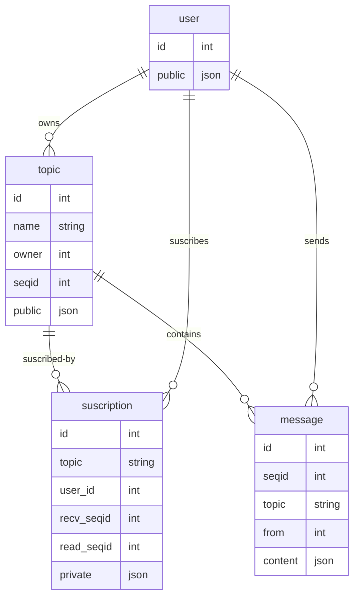

```mermaid
erDiagram
message {
    id int
    seqid int
    topic string
    from int
    content json
}

suscription {
    id int
    topic string
    user_id int
    recv_seqid int
    read_seqid int
    private json
}

user {
    id int
    public json
}

topic {
    id int
    name string
    owner int
    seqid int
    public json
}

topic 1--0+ message : contains
topic 1--0+ suscription : suscribed-by
user 1--0+ suscription : suscribes
user 1--0+ topic : owns
user 1--0+ message : sends
```

